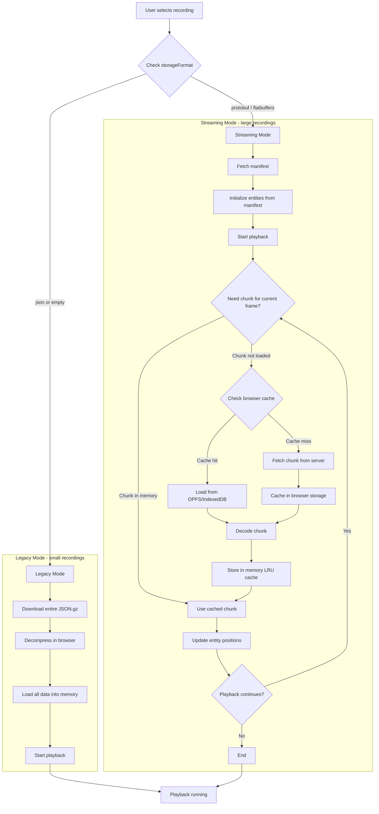
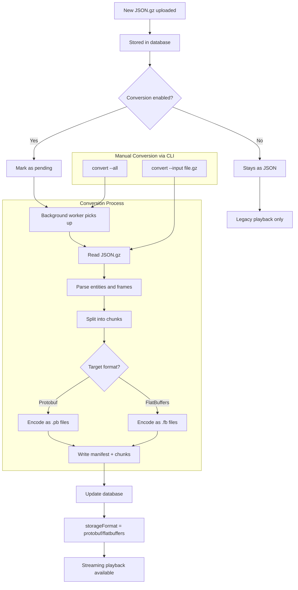

# OCAP Web component

OCAP Web serves and plays back Arma 3 mission recordings. It supports both legacy JSON recordings and chunked binary formats (Protobuf/FlatBuffers) for efficient streaming of large recordings.

## Configuration

The configuration file is called `setting.json`

### Basic Settings

| Setting | Description |
|---------|-------------|
| `listen` | Server address, e.g. `"0.0.0.0:5000"` to listen on all interfaces |
| `secret` | Secret for authenticating record uploads |
| `logger` | Enable request logging to STDOUT |

### Conversion Settings

Large recordings can be automatically converted to chunked binary format for better performance.

| Setting | Description | Default |
|---------|-------------|---------|
| `conversion.enabled` | Enable automatic background conversion | `false` |
| `conversion.interval` | How often to check for pending conversions | `"5m"` |
| `conversion.batchSize` | Max recordings to convert per interval | `10` |
| `conversion.chunkSize` | Frames per chunk (~5 min at 1 fps) | `300` |
| `conversion.storageEngine` | Target format: `"protobuf"` or `"flatbuffers"` | `"protobuf"` |

Example `setting.json`:
```json
{
  "listen": "127.0.0.1:5000",
  "secret": "your-secret",
  "logger": true,
  "conversion": {
    "enabled": true,
    "interval": "5m",
    "storageEngine": "protobuf"
  }
}
```

## Large Recording Support

### Overview

Traditional JSON recordings load entirely into browser memory, which causes crashes with large missions (500MB+). The chunked streaming system solves this by:

1. Converting recordings to binary format (Protobuf or FlatBuffers)
2. Splitting into chunks (~5 minutes each)
3. Loading only needed chunks during playback
4. Caching chunks in browser storage (OPFS/IndexedDB)

### Storage Formats

| Format | Extension | Use Case | Streaming | Performance |
|--------|-----------|----------|-----------|-------------|
| JSON | `.gz` | Legacy, small recordings | No | Baseline |
| Protobuf | `.pb` | Default chunked format | Yes | Good |
| FlatBuffers | `.fb` | Zero-copy reads | Yes | Best |

### Workflow

```
┌─────────────────────────────────────────────────────────────────┐
│                         UPLOAD                                  │
│  Mission ends → JSON.gz uploaded → Stored in data/ directory    │
└─────────────────────────────────────────────────────────────────┘
                              │
                              ▼
┌─────────────────────────────────────────────────────────────────┐
│                       CONVERSION                                │
│  Background worker (or CLI) converts to chunked binary format   │
│                                                                 │
│  data/mission.gz  →  data/mission/                              │
│                         ├── manifest.pb (metadata + entities)   │
│                         └── chunks/                             │
│                               ├── 0000.pb (frames 0-299)        │
│                               ├── 0001.pb (frames 300-599)      │
│                               └── ...                           │
└─────────────────────────────────────────────────────────────────┘
                              │
                              ▼
┌─────────────────────────────────────────────────────────────────┐
│                        PLAYBACK                                 │
│  1. Load manifest (entities, events, metadata)                  │
│  2. Load chunks on-demand as playback progresses                │
│  3. Cache chunks in browser (OPFS) for future playback          │
│  4. Evict old chunks from memory (max 3 in RAM)                 │
└─────────────────────────────────────────────────────────────────┘
```

### Playback Flow



### Conversion Flow



### CLI Commands

Convert recordings manually using the CLI:

```bash
# Convert a single file
./ocap-webserver convert --input data/mission.json.gz

# Convert to FlatBuffers instead of Protobuf
./ocap-webserver convert --input data/mission.json.gz --format flatbuffers

# Convert all pending recordings
./ocap-webserver convert --all

# Show conversion status of all recordings
./ocap-webserver convert --status

# Change storage format for an existing operation (for testing)
./ocap-webserver convert --set-format flatbuffers --id 1
```

### File Structure After Conversion

```
data/
├── mission_name.gz              # Original JSON (preserved)
└── mission_name/                # Chunked binary format
    ├── manifest.pb              # Metadata, entities, events
    └── chunks/
        ├── 0000.pb              # Frames 0-299
        ├── 0001.pb              # Frames 300-599
        └── ...
```

## Docker

### Environment Variables

| Variable | Description |
|----------|-------------|
| `OCAP_SECRET` | Secret for authorizing record uploads |
| `OCAP_CUSTOMIZE_WEBSITEURL` | Link on the logo to your website |
| `OCAP_CUSTOMIZE_WEBSITELOGO` | URL to your website logo |
| `OCAP_CUSTOMIZE_WEBSITELOGOSIZE` | Logo size (default: 32px) |
| `OCAP_CONVERSION_ENABLED` | Enable automatic conversion (`true`/`false`) |
| `OCAP_CONVERSION_INTERVAL` | Conversion check interval (e.g. `"5m"`) |
| `OCAP_CONVERSION_STORAGEENGINE` | Format: `"protobuf"` or `"flatbuffers"` |

### Volumes

| Path | Description |
|------|-------------|
| `/var/lib/ocap/data` | Recording storage (JSON and chunked formats) |
| `/var/lib/ocap/maps` | Map tiles ([download here](https://drive.google.com/drive/folders/1qtT0Fr4Dfwd48ihZNc8YN-xgxHchKoiu)) |
| `/var/lib/ocap/db` | SQLite database |

### Start an OCAP webserver instance

```bash
docker run --name ocap-web -d \
  -p 5000:5000/tcp \
  -e OCAP_SECRET="same-secret" \
  -e OCAP_CONVERSION_ENABLED="true" \
  -v ocap-records:/var/lib/ocap/data \
  -v ocap-maps:/var/lib/ocap/maps \
  -v ocap-database:/var/lib/ocap/db \
  ghcr.io/ocap2/web:latest
```

## Build from source

This Project is based on [Golang](https://golang.org/dl/)

### Windows
```bash
go build -o ocap-webserver.exe ./cmd
```

### Linux
```bash
go build -o ocap-webserver ./cmd
```

### Docker
```bash
docker build -t ocap-webserver .
```
